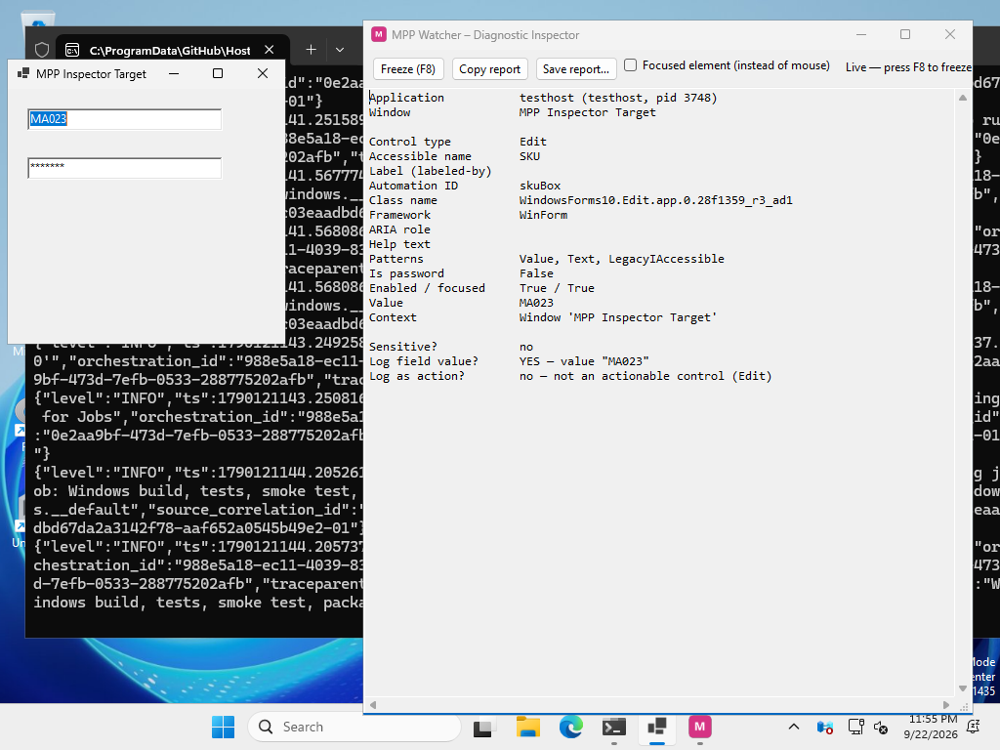
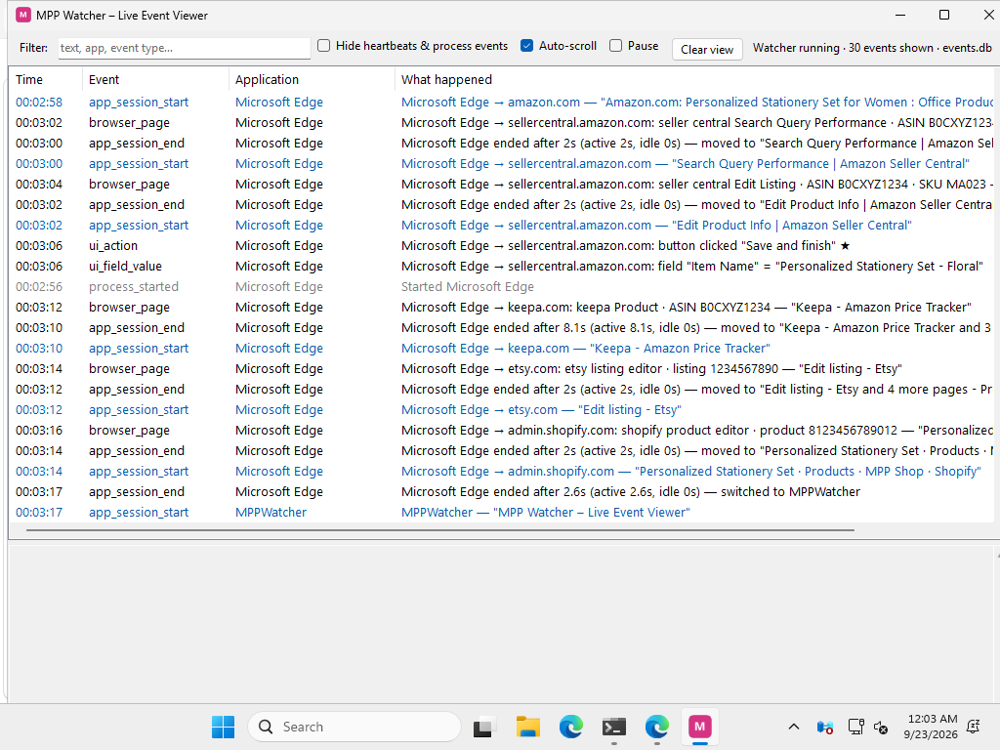

# MPP Watcher

MPP Watcher is a Windows background program for company-owned PCs. It writes a
**structured activity log** (JSON events) that can later be analysed to understand
what work was done, when, in which apps and websites, and for how long.

It does **not** take screenshots, record video/audio, or log keystrokes.
It never records password or payment fields. See [docs/PRIVACY.md](docs/PRIVACY.md).

> This phase has **no AI**. It only collects and stores clean, structured events.

## Status

| Phase | What | Status |
|---|---|---|
| 1 | App + autostart, foreground app/window sessions, processes, idle, lock/sleep, SQLite, live viewer | **Done ✅** (tested on Windows) |
| 2 | UI Automation: finished field values, clicks on named controls, sensitive-field refusal, diagnostic inspector | **Done ✅** (tested on Windows incl. Edge) |
| 3 | Browser context via UI Automation (URL, domain, page), Amazon/Seller Central/Keepa/Etsy/Shopify rules | **Done ✅** (passed two Windows runs in a row, Edge) |
| 4 | Files, document names from app titles, files opened, print jobs, downloads/uploads | In testing (17/18 Windows tests pass) |
| 5 | Local event API for scripts, Google Drive upload, `MPPWatcherSetup.exe`, watchdog service | In progress (local event API built — see [docs/LOCAL_API.md](docs/LOCAL_API.md)) |

Details, test checklist and known limits: [docs/ROADMAP.md](docs/ROADMAP.md).

## What Phase 1 records

For every stretch of time a window is in front:

```
09:00:00  app_session_start  Google Chrome — "Keepa - Amazon Price Tracker - Google Chrome"
09:04:00  app_session_end    Google Chrome ended after 4m 0s (active 4m 0s, idle 0s) — moved to "Amazon.com: Personalized Stationery Set..."
09:07:00  app_session_start  Adobe Photoshop 2025 — "MA023-main.psd @ 66.7% (Layer 1, RGB/8) *"
09:21:20  idle_start         Idle — no keyboard/mouse since 09:21:20
09:30:20  idle_end           Active again after 9m 0s idle
09:31:20  app_session_end    Adobe Photoshop 2025 ended after 12m 0s (active 2m 59s, idle 9m 0s) — switched to Google Chrome
09:31:20  app_session_start  Google Chrome — "Keepa - Amazon Price Tracker - Google Chrome" (returned after 27m 20s)
09:33:20  workstation_locked Workstation locked
```

(That is real output of the session logic from a simulated morning – see
[docs/examples](docs/examples).) Also: program start/exit (including scripts such
as `python.exe`), lock/unlock, sleep/wake, sign-out, watcher health heartbeats.

## What Phase 2 adds

```
Google Chrome → keepa.com: field "Search" = "personalized stationery"
Microsoft Edge: button clicked "Save listing" ★        (★ = key business action)
MPP UI Test Form: checkbox toggled "Gift wrap" → On
```

Password, PIN, card, CVV, code fields are never recorded. `MPPWatcher.exe --inspect` shows
what Windows exposes for anything under the mouse:



## What Phase 3 adds

Each page in the front browser is recognised from the real address bar, and every field value
and click is tied to it:



## Quick start (admin)

1. Get `MPPWatcher.exe`: download the **MPPWatcher-win-x64** artifact from the
   GitHub Actions build, or build it yourself (see [docs/DEVELOPMENT.md](docs/DEVELOPMENT.md)).
2. In an **Administrator PowerShell**, in the folder with the files:
   ```powershell
   powershell -ExecutionPolicy Bypass -File .\Install-MppWatcher.ps1 -EmployeeId EMP001
   ```
3. Open **Start Menu → MPP Watcher → MPP Watcher Live Viewer** and use the PC.
   Events appear within a second or two.

More: [docs/INSTALLATION.md](docs/INSTALLATION.md).

## Where things are

| What | Where |
|---|---|
| Program | `C:\Program Files\MPP Watcher\MPPWatcher.exe` |
| Settings (admin) | `%ProgramData%\MPP Watcher\config.json` – see [docs/CONFIGURATION.md](docs/CONFIGURATION.md) |
| Event database (per user) | `%LOCALAPPDATA%\MPP Watcher\data\events.db` |
| Exported JSONL files | `%LOCALAPPDATA%\MPP Watcher\export\MPP Activity Logs\<employee>\<date>\events_0900_1000.jsonl` (folder is configurable) |
| Troubleshooting logs | `%LOCALAPPDATA%\MPP Watcher\logs\diagnostics-YYYY-MM-DD.log` |

## Documentation

- [Architecture](docs/ARCHITECTURE.md) – components and why it is built this way
- [Event schema](docs/EVENT_SCHEMA.md) – every field and event type
- [Configuration](docs/CONFIGURATION.md)
- [Privacy and exclusions](docs/PRIVACY.md)
- [Installation](docs/INSTALLATION.md)
- [Developer setup](docs/DEVELOPMENT.md)
- [Troubleshooting](docs/TROUBLESHOOTING.md)
- [Roadmap, test checklist and limitations](docs/ROADMAP.md)
