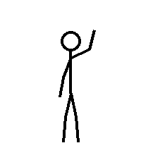

# Stick figure animations (Python)



- `wave.json` – the animation itself (a list of frames with joint angles). Save or share this file.
- `wave.gif` – a preview you can look at.
- `stick_figure.py` – makes the `.json` and turns it into a GIF.

```bash
pip install pillow
python stick_figure.py save wave.json        # make the animation file
python stick_figure.py gif wave.json wave.gif # turn it into a GIF
```

Use it in your own Python code:

```python
from stick_figure import load, to_gif, pose_lines

anim = load("wave.json")
for frame in anim["frames"]:
    lines, head = pose_lines(frame, anim["width"], anim["height"])
    # draw the lines and head with any library (Pillow, pygame, tkinter, ...)
```

## Kawaii cat


A round cat that bounces, blinks and has floating hearts.

```bash
python kawaii_cat.py save kawaii_cat.json
python kawaii_cat.py gif kawaii_cat.json kawaii_cat.gif
```

## Kawaii girl

See [kawaii_girl/](kawaii_girl/README.md): made from a real drawing, with idle, wave and pose-switching animations.
